# 10 - AWS IoT Device Shadow (Reliable LED Control)

This tutorial shows **why “direct command topics” are unreliable** for consumer IoT devices, and how **AWS IoT Device Shadow** fixes it by acting like a cloud-hosted “digital twin” that remembers the last desired state while your device is offline.

---

## How to run

### 1) Deploy AWS infrastructure (CDK)

From `10-device-shadow/`:

```bash
cd infra
make setup
make deploy
ESP_NODE_ID="ESP_NODE_01" make onboard-thing
```

Notes:
- `ESP_NODE_ID` becomes your **AWS IoT Thing Name** (and also the MQTT Client ID in firmware).
- If you don’t pass `ESP_NODE_ID`, `infra/Makefile` defaults to `ESP_NODE_001`.

### 2) Build + flash firmware (ESP-IDF)

From `10-device-shadow/`:

```bash
cd ../device_shadow
idf.py set-target esp32c2
ESP_NODE_ID="ESP_NODE_01" idf.py build flash monitor
```

Notes:
- Make sure your firmware project’s `ESP_NODE_ID` matches the Thing you onboarded (same string).
- Update Wi‑Fi + AWS endpoint in `device_shadow/main/device_shadow.c`:
  - `WIFI_SSID`
  - `WIFI_PASSWORD`
  - `MQTT_URL` (your `...-ats.iot.<region>.amazonaws.com`)

---

## The problem we are trying to solve (why direct commands fail)

The “obvious” approach is to control an LED by publishing a command message like:

- **Topic**: `nodes/ESP_NODE_01/commands`
- **Payload**: `{"command":"ON"}`

This works only when the device is online at the exact moment the command is published.

Now imagine a normal real-world glitch:

- Your ESP8684/ESP32C2 drops Wi‑Fi for **10 seconds**
- During that window, you publish `{"command":"ON"}`

The result:
- The message is **lost into the void**
- When the device reconnects, it never saw the command
- The LED stays **OFF**

In a consumer product, the user taps a button in an app, nothing happens, and they assume the product is broken.

---

## The solution: AWS IoT Device Shadow (digital twin)

AWS IoT Core has a built-in feature called **Device Shadow**. Think of it as a **virtual clone of your hardware** that lives in the cloud and remembers the last known state.

Use this diagram as the mental model:



### A Shadow is just a JSON document with two key sections

- **desired state**: what the cloud/user wants the device to do
- **reported state**: what the device says it is actually doing right now

### How it changes the game (asynchronous, reliable control)

Instead of sending “commands”, you update **desired state**.

Example:

1) Cloud updates desired to:

```json
{"state":{"desired":{"led":"ON"}}}
```

2) AWS persists that desired state, then notifies the device that there is a difference (a **delta**).

3) Device receives the delta, turns the physical LED ON, then reports back:

```json
{"state":{"reported":{"led":"ON"}}}
```

### The offline magic

If the device is offline when you request `"led":"ON"`:

- AWS simply stores the desired state
- When the device reconnects, it reads the shadow, sees the pending desired state, and applies it

No “lost command” problem.

---

## Reserved Shadow topics you must use (and only these)

Unlike custom topics like `nodes/{NODE_ID}/telemetry`, Device Shadows use **AWS Reserved Topics** starting with `$aws/things/`.

Your firmware only needs these two:

### 1) Listening post: delta updates

- **Topic**: `$aws/things/{NODE_ID}/shadow/update/delta`
- **Direction**: AWS → device (device subscribes)
- **When it fires**: only when `desired` differs from `reported`
- **Example payload**:

```json
{"state":{"led":"ON"}}
```

### 2) Reporting station: device state updates

- **Topic**: `$aws/things/{NODE_ID}/shadow/update`
- **Direction**: device → AWS (device publishes)
- **When to publish**: after you actuate the LED (and also on boot if you want the cloud to immediately know reality)
- **Required payload format**:

```json
{"state":{"reported":{"led":"ON"}}}
```

---

## Important point (common question): don’t mix direct commands with shadows

Mixing “direct command topics” with the Shadow creates a **split-brain architecture**. AWS Shadow logic assumes it is the source of truth for desired state orchestration, and the device reports the truth for physical state.

### Scenario A: Shadow becomes blind (permanent mismatch)

You keep a custom commands topic that directly changes the hardware, but you do not update the shadow.

**Step 1 (baseline)**

- Desired = OFF
- Reported = OFF
- Physical = OFF

**Step 2 (bypass shadow)**

You publish `ON` on a custom topic:

- Desired = OFF
- Reported = OFF
- Physical = ON

**Step 3 (app sets desired OFF)**

Your app updates the shadow desired to OFF:

- Desired becomes OFF (unchanged)
- AWS compares Desired (OFF) vs Reported (OFF)
- They match → **no delta is generated**

**Result**: Physical LED stays **ON forever**, while the cloud believes it is OFF.

### Scenario B: Shadow rubber-bands your device (fighting control paths)

You bypass the shadow to turn the LED ON, but then the device reports ON to the shadow.

**Step 1 (baseline)**

- Desired = OFF
- Reported = OFF
- Physical = OFF

**Step 2 (bypass shadow)**

- Desired = OFF
- Reported = OFF
- Physical = ON

**Step 3 (device reports ON)**

Device publishes:

```json
{"state":{"reported":{"led":"ON"}}}
```

AWS updates:
- Desired = OFF
- Reported = ON

AWS compares them, sees mismatch, and immediately emits a delta:

```json
{"state":{"led":"OFF"}}
```

**Result**: The LED may flash ON briefly, then immediately turns OFF again. The shadow acts like a rubber band snapping the device back to the desired state.

### Takeaway

When you adopt Device Shadows, you must go all-in:

- Cloud/app: only ever updates **desired state**
- Device: only ever listens to **delta**, and only ever reports via **shadow/update**

---

## Test it from the AWS IoT Console (end-to-end)

1) Open **AWS IoT Core Console**
2) Go to **Manage → All devices → Things**
3) Click your thing (example: `ESP_NODE_01`)
4) Go to **Device Shadows → Classic Shadow**

You should see a JSON document containing `desired` and `reported`.

### Trigger a delta (turn LED ON asynchronously)

1) Click **Edit**
2) Set:

```json
{
  "state": {
    "desired": {
      "led": "ON"
    }
  }
}
```

3) Click **Update**

Expected behavior:
- AWS publishes a delta to `$aws/things/ESP_NODE_01/shadow/update/delta`
- Your firmware parses it, actuates the GPIO, then publishes reported state to `$aws/things/ESP_NODE_01/shadow/update`
- The console will show `desired` and `reported` converge (match)

